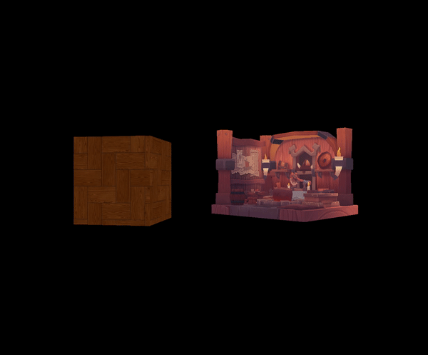
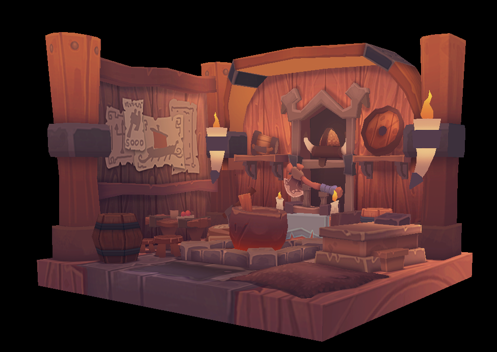
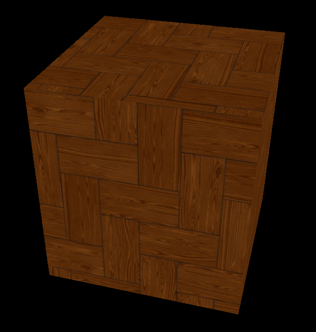
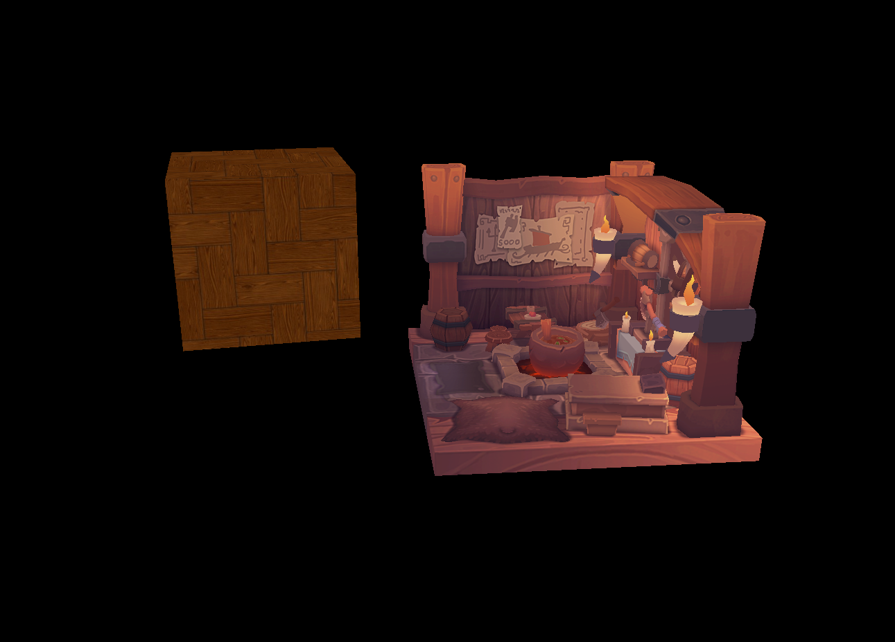

# Modern Graphics API
## Project description ##
The goal of the project is to understand the functioning of modern graphics APIs such as Vulkan or
such as Vulkan or DirectX 12. <br/>
I chose Vulkan. 



## Table of content ##
 - [Clone](#clone)
 - [Build](#build)
 - [Commands](#commands)
 - [Functionnality](#functionnality)
 - [Technologie](#technologie)
 - [Specials Thanks](#specials-thanks)
 

## Clone ##
```bash
git submodule update --init --recursive
```

## Build ##
Before running the program, you have to compile the shaders (run the file ```compile.bat``` in Resources/Shaders)

## Commands ##
- W : Move forward
- S : Move backward
- A : Move left
- D : Move right
- Space : Move up
- Shift : Move down
- Mouse : Look in a direction (FPS camera)
- Right click (Mouse) : Lock mouse in window
- Escape : close window

## Functionnality ##
- Have a window with a background color that closes with ESCAPE or the cross at the top right of the window<br/><br/>
- Draw a triangle<br/><br/>
- Draw a 3D object with perspective<br/><br/>
<br/><br/>
- Apply a movement to this cube every x seconds <br/><br/>
- Add the possibility to move in the scene with ZQSD <br/><br/>
<br/><br/>
- Add a texture on the cube <br/><br/>
<br/><br/>
- Display several objects in the 3D scene <br/><br/>
<br/><br/>


## Technologie ##
- Engine langage : C++
- Graphics Library : [Vulkan](https://www.vulkan.org/)
- Window Library : [GLFW](https://www.glfw.org/)
- Mathematics Library : [GLM](https://github.com/g-truc/glm)
- Texture Library : [STB Image](https://github.com/nothings/stb.git)
- OBJ loader Library : [TinyOBJLoader](https://github.com/tinyobjloader/tinyobjloader.git)
- IDE : Visual Studio Community 2019

## Specials Thanks ##
- Tutorials use from
    - [Vulkan-Tutorial.com](https://vulkan-tutorial.com/Introduction)
    - [Introduction to vulkan by Intel](https://github.com/GameTechDev/IntroductionToVulkan)
    - [Prog'Z](https://www.youtube.com/@ProgZ)
- Teachers from Isart

<br/>
<hr/>
For ISART DIGITAL <br/>
Author : Vincent DEVINE <br/>
Start : 31/01/2023 <br/>
End : 17/02/2023<br/>
